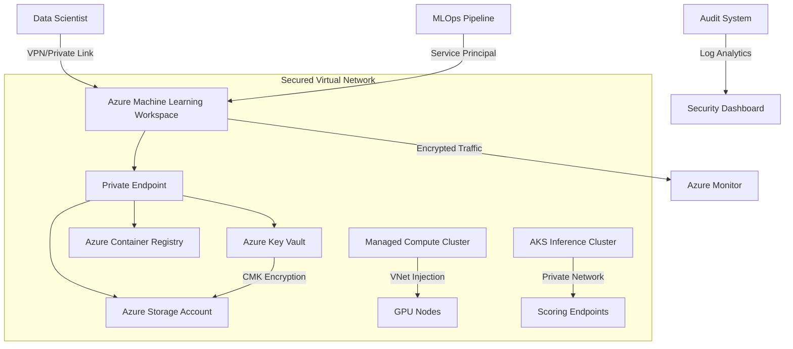

# Secure Azure Machine Learning Architecture Guide

## Reference Architecture Diagram


## Compliance Control Mapping

### Regulatory Standards Implementation

| Control Framework | AML Security Implementation | Azure Service Used |
|--------------------|-----------------------------|--------------------|
| **NIST 800-53**    | SC-7 (Boundary Protection)  | Network Security Groups<br>Azure Firewall |
|                    | SC-28 (Data Protection)     | Azure Disk Encryption<br>Customer-Managed Keys |
| **HIPAA**          | §164.312(e)(2) Transmission Security | Private Link<br>VPN Gateway |
| **GDPR**           | Article 25 (Data Protection by Design) | Purview Data Catalog<br>AML Data Labeling |
| **ISO 27001**      | A.13 (Network Security)     | Azure DDoS Protection<br>Web Application Firewall |

### Security Control Details

1. **Network Isolation**
   - **Implementation**: Private Endpoints + NSG Flow Logs
   - **Validation Command**:
   ```bash
   az network private-endpoint list --resource-group $RG
   ```

2. **Data Encryption**
   - **Pattern**: Double Encryption (Platform + CMK)
   - **Audit Check**:
   ```powershell
   Get-AzStorageAccount -Name $STORAGE_ACCT | Select-Object Encryption
   ```

3. **Access Control**
   - **RBAC Model**:
     ```text
     AML Data Scientist: Can train models but not delete workspaces
     AML Security Admin: Manages encryption and network settings
     MLOps Engineer: Deployment rights only
     ```

## Deployment Checklist

1. **Network Foundation**
   - [ ] Deploy Hub-Spoke Virtual Network
   - [ ] Configure Azure Firewall with ML FQDN Rules
   - [ ] Enable Private DNS Zones for AML Services

2. **Workspace Security**
   - [ ] Enable Customer-Managed Keys
   - [ ] Disable Public Network Access
   - [ ] Configure Managed Identity for Compute

3. **Monitoring & Compliance**
   - [ ] Enable Diagnostic Settings to Log Analytics
   - [ ] Configure Microsoft Sentinel AML Workbooks
   - [ ] Set Up Quarterly Access Reviews


<security-advisory>
⚠️ Critical Security Notes:
1. Always restrict Jupyter notebooks to VNet-only access
2. Rotate workspace CMK keys quarterly
3. Audit compute cluster auto-scale limits to prevent cost exploits
</security-advisory>

---

[Download Architecture Diagrams](https://learn.microsoft.com/en-us/azure/architecture/reference-architectures/ai/mlops-aml) (PDF/Visio)  
[Compliance Documentation Template](compliance-report-template.docx)
